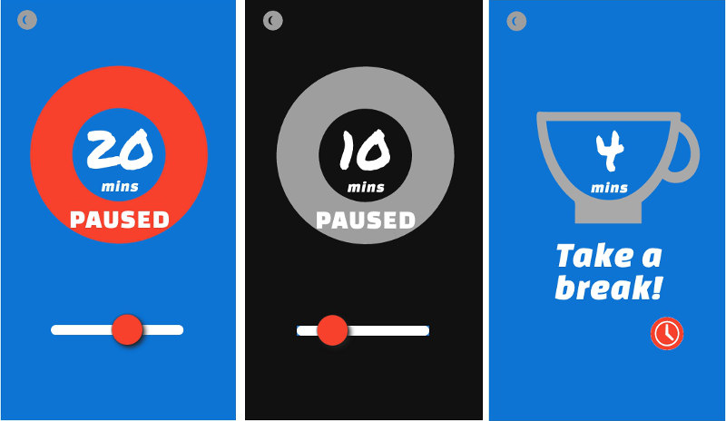

# [PromodoApp](https://appijumbo.github.io/PromodoApp/)

This timer is also on [Codepen](http://codepen.io/tom_o/pen/XdXqOB)

Made for the [Free Code Camp course](http://www.freecodecamp.com/challenges/build-a-pomodoro-clock)

## Objectives

The basic Free Code camp requirements were:-

* start a 25 minute pomodoro, and the timer will go off once 25 minutes has elapsed
* reset the clock for my next pomodoro
* customise the length of each pomodoro

In addition to the basic Free Code camp requirements, 
professional versions also favoured:

* Dark theme capable
* Charts of achievements of past promodos
* Different screens for promodo and break-time

## Market Review
Basic [market Research](./promodo_design/./promodo_design/market%20research.jpg) was done by looking at comments from users on other promodo apps in the Google App store. 
Some conclusions were

Basic market research suggests:

  * Not always possible to complete sessions

  * Thin circles are not easy to see

  * Can Pick break or promodo

  * Color customization is useful; dark mode

## Design Process

[Initial design](./promodo_design/IA v3.jpg) looked like

### Creating an MVP
The design was simplified and screen workflow (roughly speaking a 'Information Architecture' (IA) design) was produced to focus on some minimal viable product

[Promodo IA v1](./promodo_design/Promodo IA v1.jpg)

secong version MVP
[Promodo IA v2](./promodo_design/Promodo map v2.jpg)

The 'final' detailed wireframe MVP was 'tested' by using a scaled pdf for a mobile screen.

[360x640 MotoG presentaion v7_1](./promodo_design/360x640%20MotoG%20presentaion%20v7_1.jpg)

[360x640 MotoG presentaion v7_2](./promodo_design/360x640%20MotoG%20presentaion%20v7_2.jpg)

[360x640 MotoG presentaion v7_3](./promodo_design/360x640%20MotoG%20presentaion%20v7_3.jpg)

Note that the tool tips wasn't implemented but would have been acheived by employing data attributes in the html. The dark theme that was implemented in the final version used as similar approach.

[Final MVP design](./promodo_design/wireframe v14.pdf)

### Sass

Variables: widths, heights, colors, z-index's
[Google Color Palette](https://github.com/danlevan/google-material-color) and [restricted fonts](https://mendel.me/development/using-google-fonts-css-stylesheet)

### Event  bubbling

Rather than lots of addEventListers; use the event object and allow the event flow carol built into the browser to ‘bubble’ up to get the element ID clicked

Mini-state machine used
The different states can be be represented in a global variable, then a switch case statement can control the state flow, like a mini-state machine.

### d3

Using d3 to make an arc for the counter graphic is probably a bit of an overkill as we could use CSS. However if the app were to be used for real, I’d probably add charts to display records of promodos used. Also Im going to have to learn how to use d3.
So for those two reasons I decided to use d3 to make the arc for the countdown.

### Input Range Slider

Decided to use a slider to control the primed time rather than a button as used in the FCC version.
See [input range](https://github.com/darlanrod/input-range-sass) 

### One-click Dark Theme
As part of the design process I determined that having a simple click for a dark theme may prove to be a usefull addition given it is intended for use on a desktop where dark themes are often prefered. By clicking this a data attribute is toggled which informs the CSS. The implementing proved to be a little tedious, I've personaly found the function quite usefull.

### SVG's id's given and Xlink used

By using xlink, we can put in-line svg’s at the top of the HTML, then link them into the appropriate place using \<use id=“the_link_id”> 

### Data attributes on HTML

We can define an attribute data-state=“on” or off, which will toggle the CSS. This might work better than simply having a class applied

### Sound

Just for fun, add a couple of sound files that play at the beginning and end of the primed. Decided to mix some free ones found on Freesound.org

